# FLOWER VLA with Mean Flow Integration - Architecture Flow

```mermaid
flowchart TD
    %% Input Layer
    Start([Training Step]) --> Input["Input Data<br/>- Observations: images, language<br/>- Actions: ground truth"]

    Input --> EncodeObs["Encode Observations<br/>Vision + Language Encoders"]

    %% Time Sampling Branch Point
    EncodeObs --> TimeSample{Time Sampling<br/>Method?}

    %% Standard RF Path
    TimeSample -->|Standard RF| SampleT["Sample t from U(0,1)<br/>Single timestep"]
    SampleT --> InterpolateRF["Interpolate: z_t = (1-t)·x + t·ε<br/>Standard RF interpolation"]

    %% Mean Flow Path
    TimeSample -->|Mean Flow| SampleTR["Sample t, r with t ≥ r<br/>Set r = t for 75% of samples"]
    SampleTR --> InterpolateMF["Interpolate: z_t = (1-t)·x + t·ε<br/>Same interpolation"]

    %% DiT Processing
    InterpolateRF --> DiTForward["DiT Forward Pass<br/>Process noisy actions"]
    InterpolateMF --> DiTForward

    %% DiT Blocks
    DiTForward --> DiTBlocks["DiT Transformer Blocks<br/>- Self-attention<br/>- Cross-attention with obs<br/>- Time conditioning"]

    %% Decoder Branch Point
    DiTBlocks --> DecoderChoice{Decoder<br/>Architecture?}

    %% Standard Decoder
    DecoderChoice -->|Standard| LinearDecoder["Linear Decoder<br/>nn.Linear dit_dim → action_dim<br/>Input: z, t"]
    LinearDecoder --> PredVelocity["Predict: v_θ<br/>Instantaneous velocity"]

    %% Mean Flow Decoder
    DecoderChoice -->|Mean Flow| MFDecoder["MeanFlowDecoder<br/>MLP with h embedding<br/>Input: z, t, h=t-r"]
    MFDecoder --> PredAvgVelocity["Predict: u_θ<br/>Average velocity over (r,t)"]

    %% Loss Computation Branch
    PredVelocity --> LossChoice{Loss<br/>Function?}
    PredAvgVelocity --> LossChoice

    %% Standard RF Loss
    LossChoice -->|Standard RF| RFLoss["Rectified Flow Loss<br/>L = ||v_θ - (ε-x)||²<br/>Simple MSE"]
    RFLoss --> Backward["Backward Pass<br/>Standard gradient descent"]

    %% Mean Flow Loss
    LossChoice -->|Mean Flow| MFLoss["Mean Flow Loss<br/>with JVP"]

    %% Mean Flow Loss Details (Subgraph)
    MFLoss --> ComputeDUDT["Compute ∂u/∂t using JVP<br/>torch.func.jvp with tangents<br/>v, dtdt=1, drdt=0"]
    ComputeDUDT --> TargetVel["Target: u_tgt = v - h·∂u/∂t<br/>Detached from graph"]
    TargetVel --> AdaptiveLoss["Adaptive Weighted Loss<br/>L = ||u_θ - u_tgt||²/w<br/>w = (loss.detach + ε)^p"]
    AdaptiveLoss --> Backward

    %% Training Update
    Backward --> UpdateWeights["Update Model Weights<br/>Optimizer step"]
    UpdateWeights --> TrainEnd([End Training Step])

    %% =====================================
    %% INFERENCE FLOW - Sampling
    %% =====================================

    InferStart([Inference Start]) --> InferInput["Input:<br/>- Observations<br/>- Initial noise z_1 from N(0,I)"]
    InferInput --> InferEncode["Encode Observations"]

    InferEncode --> SampleChoice{Sampling<br/>Strategy?}

    %% Multi-step RF Sampling
    SampleChoice -->|Multi-step RF| MultiStep["Multi-step ODE Solver<br/>N steps (typically 10-50)"]
    MultiStep --> RFLoop["For i = N to 1:<br/>t = i/N<br/>v = DiT + Linear(z, t)<br/>z = z - (1/N) · v<br/>(repeat N times)"]
    RFLoop --> ClampRF["Clamp: z_0 in (-1, 1)"]

    %% 1-step Mean Flow Sampling
    SampleChoice -->|1-step Mean Flow| OneStep["Single Forward Pass<br/>t = 1, h = 1"]
    OneStep --> MFInfer["u = DiT + MFDecoder(z_1, t=1, h=1)"]
    MFInfer --> DirectStep["Direct step: z_0 = z_1 - u"]
    DirectStep --> ClampMF["Clamp: z_0 in (-1, 1)"]

    %% Alternative: Multi-step Mean Flow
    SampleChoice -->|Multi-step Mean Flow| MultiStepMF["Multi-step with h<br/>N steps"]
    MultiStepMF --> MFLoop["For i = N to 1:<br/>t = i/N, r = (i-1)/N<br/>h = t - r<br/>u = DiT + MFDecoder(z, t, h)<br/>z = z - h · u<br/>(repeat N times)"]
    MFLoop --> ClampMF

    %% Final Output
    ClampRF --> Output["Output Actions"]
    ClampMF --> Output
    Output --> InferEnd([Inference End])

    %% Styling
    classDef rfStyle fill:#e1f5ff,stroke:#0288d1,stroke-width:2px,color:#000
    classDef mfStyle fill:#fff3e0,stroke:#f57c00,stroke-width:2px,color:#000
    classDef decisionStyle fill:#f3e5f5,stroke:#7b1fa2,stroke-width:3px,color:#000
    classDef sharedStyle fill:#e8f5e9,stroke:#388e3c,stroke-width:2px,color:#000

    class SampleT,InterpolateRF,LinearDecoder,PredVelocity,RFLoss,MultiStep,RFLoop,ClampRF rfStyle
    class SampleTR,InterpolateMF,MFDecoder,PredAvgVelocity,MFLoss,ComputeDUDT,TargetVel,AdaptiveLoss,OneStep,MFInfer,DirectStep,MultiStepMF,MFLoop,ClampMF mfStyle
    class TimeSample,DecoderChoice,LossChoice,SampleChoice decisionStyle
    class EncodeObs,DiTForward,DiTBlocks,Backward,UpdateWeights,InferEncode sharedStyle
```



## Key Components Explained

### 🔵 Standard Rectified Flow (Blue)
- **Time Sampling**: Single timestep `t ~ U(0,1)`
- **Decoder**: Simple linear projection `nn.Linear(dit_dim, action_dim)`
- **Loss**: Standard MSE between predicted and target velocity
- **Sampling**: Multi-step ODE solver (10-50 steps typical)

### 🟠 Mean Flow Implementation (Orange)
- **Time Sampling**: Two timesteps `t, r` with `t ≥ r`, and `r = t` for 75% of samples
- **Decoder**: MLP with timestep difference embedding `h = t - r`
- **Loss**: JVP-based loss computing `∂u/∂t` with adaptive weighting
- **Sampling**: **1-step generation** (much faster!) or multi-step with `h`

### 🟣 Decision Points (Purple)
Where you choose between Standard RF and Mean Flow approaches

### 🟢 Shared Components (Green)
Used by both architectures without modification

---

## Integration Complexity by Component

| Component | Complexity | Files Modified |
|-----------|------------|----------------|
| **MeanFlowDecoder** | 🟡 Medium | `flower/models/networks/transformers.py` |
| **sample_tr** | 🟡 Medium | `flower.py:590-604` |
| **meanflow_loss with JVP** | 🔴 Hard | `flower.py` (new method) |
| **decode_actions** | 🟢 Easy | `flower.py:857-873` |
| **dit_forward** | 🟢 Easy | `flower.py:570,632` |
| **training_step** | 🟢 Easy | `flower.py:448` |
| **sample_actions** | 🟢 Easy | `flower.py:565` |

---

## Critical Implementation Notes

### JVP (Forward-mode AD) is REQUIRED
```python
u, dudt = torch.func.jvp(
    u_func,
    (z, t, r),
    (torch.zeros_like(z), torch.ones_like(t), torch.zeros_like(r))
)
```

### Main Advantages of Mean Flow
1. **1-step sampling**: 10-50x faster inference
2. **Better sample quality**: Average velocity more stable than instantaneous
3. **Training stability**: Adaptive weighting balances loss landscape
4. **Theoretical guarantees**: Provably better ODE approximation

### Expected Performance
- **Training**: Slightly slower per step (JVP computation)
- **Inference**: 10-50x faster (1-step vs multi-step)
- **Sample Quality**: Comparable or better with fewer steps

---

## Implementation Strategy

### Phase 1: Core Components (1-2 days)
1. Implement `MeanFlowDecoder` class
2. Update `sample_tr` with data proportion
3. Add `h` parameter through the pipeline

### Phase 2: Loss Function (2-3 days)
4. Implement `meanflow_loss` with JVP
5. Verify gradient computation correctness
6. Test on small batch

### Phase 3: Integration (1 day)
7. Switch training to use Mean Flow loss
8. Update sampling for 1-step inference
9. Compare with baseline RF

### Phase 4: Validation (1-2 days)
10. Train on full dataset
11. Evaluate sample quality
12. Benchmark inference speed

---

## References
- **Paper**: [Mean Flow (2024)](https://arxiv.org/abs/2410.01617)
- **PyTorch Code**: [github.com/Gsunshine/py-meanflow](https://github.com/Gsunshine/py-meanflow)
- **JAX Code**: [github.com/Gsunshine/meanflow](https://github.com/Gsunshine/meanflow)
